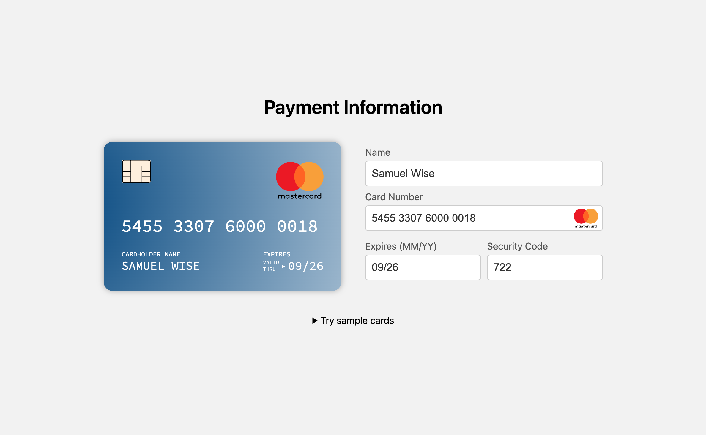
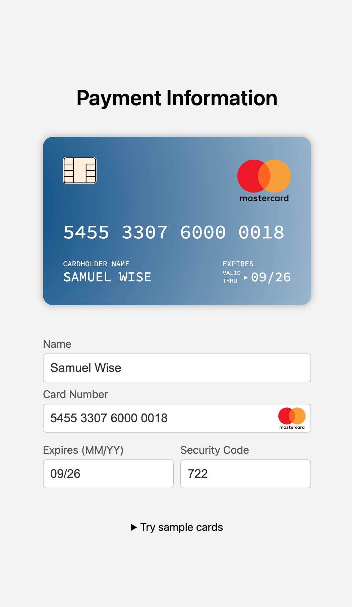

# React Credit Card Detector





This React project can detect and display card type icons for various debit and credit card providers. It recognizes the following card types:

- American Express (Amex)
- Diners Club
- Discover
- JCB
- Maestro
- Mastercard
- UnionPay
- Visa

User experience is enhanced by dynamically displaying the corresponding fields and card type icons based on the entered card number, with a smooth and interactive UI for entering payment information.

## Built With

- React/JavaScript
- Vite

## Live Demo

https://credit-card-detector.vercel.app/

## Prerequisites

- Node.js and npm (Node Package Manager)

## Installing

To set up a development environment:

1. Clone the repository

```sh
git clone https://github.com/samuelurom/credit-card-detector
```

2. Navigate to the project directory

```sh
cd credit-card-detector
```

3. Install dependencies

```sh
npm install
```

4. Run the application

```sh
npm run dev
```
